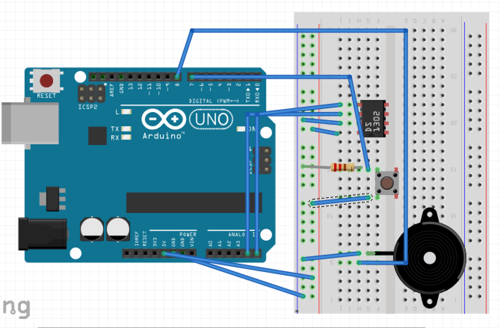

# P00: Project 1

**Authors**: Sarah Watts and Nick Straub-Deck 
[**Google Document**](https://docs.google.com/document/d/1fMCTf0CLFllbEqdRbCc9xuTkVDU8cLeUY6zbcaRNZho/edit?usp=sharing)

---
## Purpose

Me and Nick both work for event production, and we have a problem with remebering to clock  out after 5 hours. This is because usually events and prepping for them can take a lot of time, so we usually don't notice the clock unless it is about the event time. So our product will have a timer that counts down 5 hours, and then it will buzz or make a noise to indicate that it is time to clock out and take a thirty mintue break.  

## Design Plan

### Hardware:  
- Arudino 
- Buzzer
- Button
- Real Time Clock

**Diagram**  

### Software:  
- A function that will count to five hours,and then once it ends quite buzzing sound. 
- A loop that will check in the button is pressed

## Files

 - ReadME.md: describes the project.
### Inside Images Folder 
 - diagram0.png: first diagram of the project. 
### Inside Ardunio Folder  
- P1.ino: Ardunio program that runs the system, at the moment it just tests the clock and the button
## Instructions

## Errors and Constraints

## Reflection

## References . 
- http://docs.macetech.com/doku.php/chronodot_v2.0 : Used to get the clock to work
- https://www.arduino.cc/en/tutorial/button: Used to get the button to work.
- https://www.arduino.cc/reference/en/#functions: Used to remember variable names on boolean functions.  
- http://forum.arduino.cc/index.php?topic=43582.0: Used to remember the syntax for an if statement with an or
- https://forum.arduino.cc/index.php?topic=401274.0: Used to remember the syntax of true.

## Final Self-Evaluations
*You'll complete this part at the end of the project. 
Assign points to each team member in each category, based on their contribution to the team. 
The sum of all member's points in each category cannot exceed 10. 
For example, for Coding, Partner 1 could get 7 points, and Partner 2 gets 3 points. 
You can't give both people 6 points each though, as the sum exceeds 10.

### Ideation, Brainstorming, Design:

*Partner 1 (Sarah): 0-10*

*Partner 2 (Nick): 0-10*

### Code creation: 

*Partner 1 (Sarah): 0-10*

*Partner 2 (Nick): 0-10*

### Documentation creation:

*Partner 1 (Sarah): 0-10*

*Partner 2 (Nick): 0-10*

### Teamwork & Participation:

*Partner 1 (Sarah): 0-10*

*Partner 2 (Nick): 0-10*

---
